# 实验报告

PB20111689 蓝俊玮

[TOC]

## 实验一. 图像几何变换

### 1. 图像的平移

图像平移就是将图像中所有的点都按照指定的平移量水平、垂直移动。假设 $(x_0, y_0)$ 为原图像的一点，图像水平平移量为 $tx$，垂直平移量为 $ty$，则平移后的坐标表示如下：

$$
\begin{bmatrix}x_1\\ y_1\\ 1\end{bmatrix}=\begin{bmatrix}1&0&\text{tx}\\ 0&1&\text{ty}\\ 0&0&1\end{bmatrix}\begin{bmatrix}x_0\\ y_0\\ 1\end{bmatrix}
$$

为了实现上述平移的矩阵表示，可以使用 matlab 的库函数 `imtranslate` 进行平移操作。将平移的偏移量用 `[tx, ty]` 传入：

```matlab
function lab1_1(filename, tx, ty)
    src = imread(filename);
    % translation
    dst = imtranslate(src, [tx, ty]);
end
```

运行指令 `lab1_1("lena.bmp", 100, 50)` 的结果如下 (水平平移量为 $100$，垂直平移量为 $50$)：

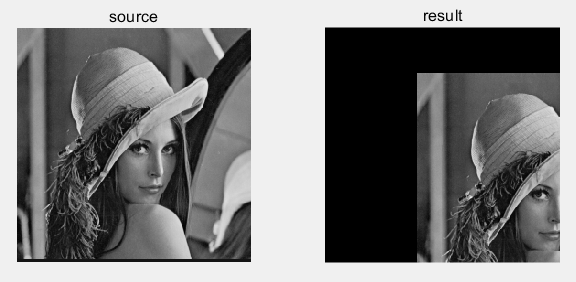

### 2. 图像的旋转

与图像的平移类似，图像的旋转表达式如下：

$$
\begin{bmatrix}x_1\\ y_1\\ 1\end{bmatrix}=\begin{bmatrix}\cos(\theta)&\text{-sin}(\theta)&0\\ \sin(\theta)&\cos(\theta)&0\\ 0&0&1\end{bmatrix}\begin{bmatrix}x_0\\ y_0\\ 1\end{bmatrix}
$$

为了实现上述旋转的矩阵表示，可以使用 matlab 的库函数 `imrotate` 进行旋转操作。将旋转的角度 `angle` 传入函数。灰度内插有两种常用方法：最近邻点法和双线性内插法。最近邻插值法的做法是取像素点周围邻点中距离最近的像素值灰度，而双线性插值法利用周围的邻点灰度在两个方向进行线性插值操作。

然后对于最近邻插值和双线性插值的选项可以通过传入参数 `nearest` 或者 `bilinear` 来确认：

```matlab
function lab1_2(filename, angle)
    src = imread(filename);
    dst1 = imrotate(src, angle, 'nearest', 'crop');
    dst2 = imrotate(src, angle, 'bilinear', 'crop');
end
```

运行指令 `lab1_2("lena.bmp", 90)` 的结果如下 (旋转角度为 $90$ 度)：

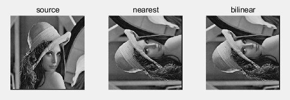

### 3. 图像的缩放

假设图像 $x$ 轴方向缩放比率为 $c$，$y$ 轴方向缩放比率为 $d$，则图像缩放的转换矩阵为：

$$
\begin{bmatrix}x_1\\ y_1\\ 1\end{bmatrix}=\begin{bmatrix}c&0&0\\ 0&d&0\\ 0&0&1\end{bmatrix}\begin{bmatrix}x_0\\ y_0\\ 1\end{bmatrix}
$$

对于图像的缩放，在 matlab 中可以使用 `imresize` 进行缩放操作。由于 `imresize` 是将图像重置到一定的图像大小，因此需要根据比例来计算出图像的宽和高。同时对于最近邻插值和双线性插值的选项可以通过传入参数 `nearest` 或者 `bilinear` 来确认：

```matlab
function lab1_3(filename, c, d)
    src = imread(filename);
    [row, col, ~] = size(src);
    dst1 = imresize(src, [row * d, col * c], 'nearest');
    dst2 = imresize(src, [row * d, col * c], 'bilinear');
end
```

运行指令 `lab1_3("lena.bmp", 2, 3)` 的结果如下 (将图像从 $x$ 轴放大 $2$ 倍 $y$ 轴放大 $3$ 倍)：

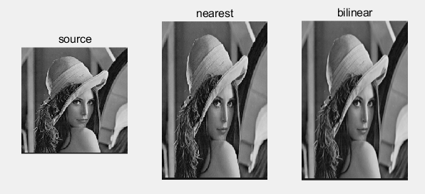

### 4. 图像几何失真校正

图像几何失真校正包括两个主要步骤：关系位置和灰度插值。位置关系就是对于原图像 $f(x,y)$ 和失真图像 $g(x',y')$，需要找到一个位置对应关系。通常可以用一个双线性失真模型来描述这个位置关系

$$
\left\{\begin{matrix}x'=\mathrm a_1\mathrm x\mathrm y+\mathrm a_2\mathrm x+\mathrm a_3\mathrm y+\mathrm a_4\\ \mathrm y'=\mathrm b_1\mathrm x\mathrm y+\mathrm b_2\mathrm x+\mathrm b_3\mathrm y+\mathrm b_4\end{matrix}\right.
$$

这个双线性失真模型有 $8$ 个系数，因此我们至少需要选择 $4$ 个控制点对。因此使用 `ginput(8)` 获取 $4$ 个控制点对。首先通过 `ginput(8)` 获取原图像的 $4$ 个控制点到 `coord1`，然后获取失真图像的 $4$ 个控制点。在获取了控制点对后，需要对系数进行拟合。可以使用 `fitgeotrans()` 函数对控制点对组进行几何变换拟合。根据图像的失真情况，选择 `projective` (当场景出现倾斜时，请使用此变换。直线保持笔直，但平行线向消失点收敛) 变换类型。

在得到变换式后，就可以通过 `imwarp()` 函数对图像应用几何变换，并且通过选择 `nearest` 或者 `bilinear` 可以确认灰度插值的方式：


```matlab
function lab1_4(filename1, filename2)
    src1 = imread(filename1); % src1 为原图像
    src2 = imread(filename2); % src2 为失真图像
    subplot(1, 2, 1); imshow(src1); title('source 1');
    subplot(1, 2, 2); imshow(src2); title('source 2');
    
    [x, y] = ginput(8);
    % 原图像的 4 个控制点
    coord1 = [x(1) y(1); x(2) y(2); x(3) y(3); x(4) y(4)];
    % 失真图像的 4 个控制点
    coord2 = [x(5) y(5); x(6) y(6); x(7) y(7); x(8) y(8)];
    % 几何变换拟合
    trans = fitgeotrans(coord1, coord2, 'projective');
    
    % 应用几何变换
    dst1 = imwarp(src1, trans, 'nearest');
    dst2 = imwarp(src1, trans, 'bilinear');
end
```

运行程序后的结果如下 (选择的控制点对为 $4$ 个顶角)：

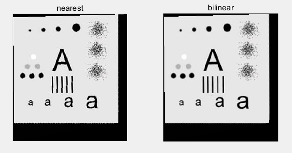

## 实验二. 图像点处理增强

### 1. 灰度的线性变换

灰度的线性变换就是将图像中所有的点的灰度按照线性灰度变换函数进行变换。该线性灰度变换函数是一个一维线性函数：

$$
D_B=f_A\cdot D_A+f_B
$$

其中参数 $A_f$ 为线性函数的斜率，$B_f$ 为线性函数的在 $y$ 轴的截距， $D_A$ 表示输入图像的灰度，$DB$ 表示输出图像的灰度。

那么实现的时候，可以对图像中的每个像素值都进行一次线性变换操作：

```matlab
function lab2_1(filename, fa, fb)
    src = imread(filename);
    [row, col, ~] = size(src);
    dst = zeros(row, col);
    % 对所有像素都进行一次线性变换
    for y = 1 : row
        for x = 1 : col
            dst(y, x) = src(y, x) * fa + fb;
        end
    end
end
```

运行指令 `lab2_1("lena.bmp", 2, 125)` 的结果如下 (斜率为 $2$，截距为 $125$)：

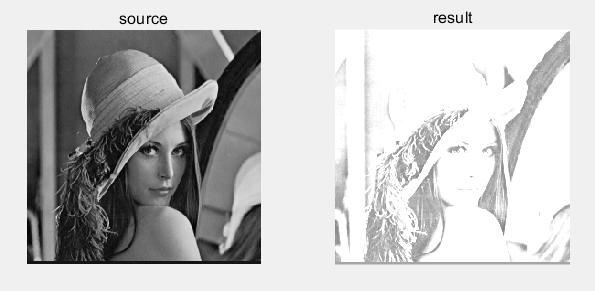

### 2. 灰度拉伸

灰度拉伸和灰度线性变换相似。不同之处在于它是分段线性变换。表达式如下：

$$
\begin{aligned}
&f(x) =\frac{y_{1}}{x_{1}}x; && x<x_1  \\
&f(x) =\frac{y_2-y_1}{x_2-x_1}(x-x_1)+y_1; && x_{1}\leq x\leq x_{2}  \\
&f(x) =\frac{255-y_2}{255-x_2}(x-x_2)+y_2; && x>x_{2} 
\end{aligned}
$$

其中，$(x_1,y_1)$ 和 $(x_2,y_2)$ 是分段函数的转折点。

```matlab
function lab2_2(filename, x1, y1, x2, y2)
    src = imread(filename);
    [row, col, ~] = size(src);
    dst = zeros(row, col);
    % 对所有像素都进行一次线性变换
    for y = 1 : row
        for x = 1 : col
            pixel = src(y, x);
            if (pixel < x1)
                dst(y, x) = pixel * (y1 / x1);
            elseif (pixel <= x2)
                dst(y, x) = (pixel - x1) * ((y2 - y1) / (x2 - x1)) + y1;
            else
                dst(y, x) = (pixel - x2) * ((255 - y2) / (255 - x2)) + y2;
            end
        end
    end
    
    subplot(1, 2, 1); imshow(src); title('source');
    subplot(1, 2, 2); imshow(uint8(dst)); title('result');
end
```

运行指令 `lab2_2("lena.bmp", 32, 64, 64, 192)` 的结果如下 (选择的两个转折点为 $(32,64)$ 和 $(64, 192)$)：

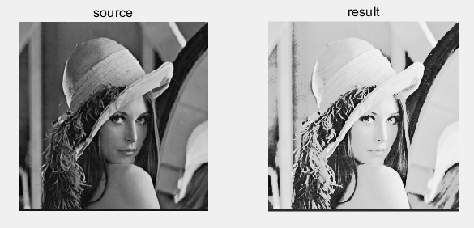

### 3. 灰度直方图

灰度直方图是灰度值的函数，描述的是图像中具有该灰度值的像素的个数，其横坐标 表示像素的灰度级别，纵坐标表示该灰度出现的频率(象素的个数)。

通过 matlab 的库函数 `histogram` 就可以获取图像的灰度直方图。同时，为了显示特定范围的灰度直方图，可以传入参数 `BinLimits` 来确认需要所需显示的范围：

```matlab
function lab2_3(filename, left, right)
    src = imread(filename);
    
    subplot(1, 2, 1); imshow(src); title('source');
    subplot(1, 2, 2); histogram(src, 'BinLimits' ,[left, right]); title('result');
end
```

运行指令 `lab2_3("lena.bmp", 100, 200)` 的结果如下 (选择的范围为 $[100,200]$)：

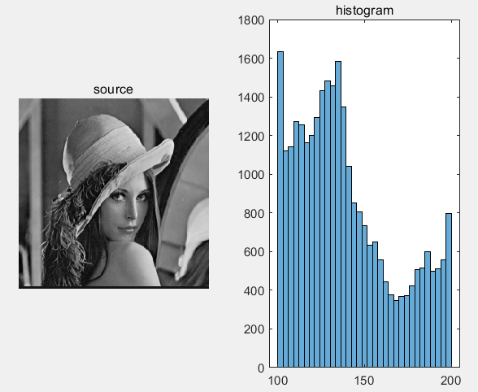

### 4. 直方图均衡

直方图均衡可以将图像的直方图变成近似均匀分布的形式，在 matlab 中可以通过 `histeq` 函数进行直方图均衡化以增强对比度。直方图规定化可以将任意形状的直方图变成指定形状的直方图，在 matlab 中也可以通过 `histeq` 函数进行直方图规定化。在本次实验中将直方图规定化为高斯分布，因此我们需要生成一个灰度图像像素值的高斯分布。那么对于灰度图像像素值的取值范围是 $0$ 到 $255$ 来说，则取均值为 $127$ 方差为 $32$ 的高斯分布，用 `normpdf(dist, 127, 32)` 生成高斯分布像素灰度值分布。

```matlab
function lab2_4(filename)
    src = imread(filename);
    % 直方图均衡化
    eq = histeq(src);
    % 像素灰度值取值范围
    dist = (0 : 1 : 255);
    % 直方图规定化
    eq2 = histeq(src, normpdf(dist, 127, 32));
end
```

运行程序的结果如下：

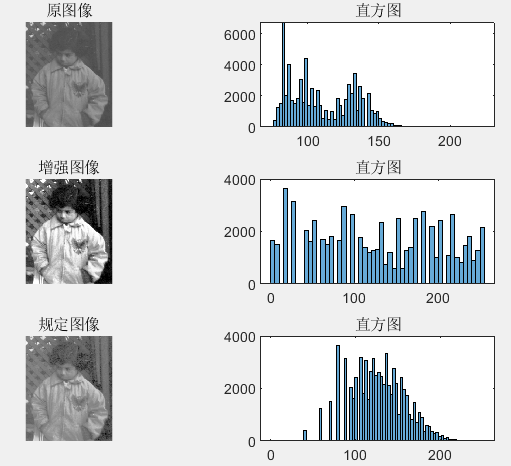

## 实验三. 图像空间域滤波增强

本次实验需要使用 $3$ 种噪声类型的图像进行滤波操作。这些噪声分别是 $3\%$ 的椒盐噪声，高斯噪声和随机噪声。椒盐噪声是受噪声干扰的图像像素以 $50\%$ 的相同概率等于图像灰度的最大或最小可能取值。高斯噪声是噪声的概率密度函数服从高斯分布。随机噪声是受噪声干扰图像像素点取值均匀分布于图像灰度的最大于最小可能取值之间。

在 matlab，可以通过库函数 `imnoise` 和参数来生成椒盐噪声和高斯噪声。对于随机噪声，可以在产生椒盐噪声的位置上，对其取随机值产生，这样就可以确保随机噪声的产生规模。

```matlab
p_src = imnoise(src, 'salt & pepper', 0.03); % 椒盐噪声
g_src = imnoise(src, 'gaussian'); % 高斯噪声
[row, col, ~] = size(src);
temp = imnoise(src, 'salt & pepper', 0.03); % 通过椒盐噪声来产生随机噪声
r_src = src; % 随机噪声
for i = 1 : row
    for j = 1 : col
        if (temp(i, j) ~= src(i, j))
            r_src(i, j) = uint8(rand() * 255);
        end
    end
end
```

### 1. 均值滤波器

均值滤波器的定义表示如下：

$$
g(i,j)=\frac{1}{3\times3}\sum_{(x,y)\in A}f(x,y)
$$

其中 $A$ 表示像素 $(i,j)$ 周围 $3\times3$ 窗口的像素点集。通过 matlab 中库函数 `imfilter()`，传入参数 `average` 和滤波器窗口大小 $3$ 便可以实现 $3\times3$ 的均值滤波器：


```matlab
function lab3_1(filename)
    src = imread(filename);
    % generate noise ......
    % mean filter
    p_dst = imfilter(p_src, fspecial('average', 3)); % 椒盐噪声
    g_dst = imfilter(g_src, fspecial('average', 3)); % 高斯噪声
    r_dst = imfilter(r_src, fspecial('average', 3)); % 随机噪声
end
```

运行程序的结果如下：

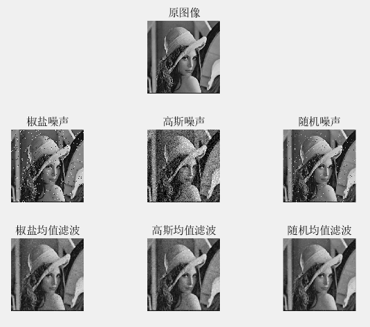

### 2. 超限领域平均法

超限领域平均法就是如果某个像素的灰度值大于其领域像素的平均值，且达到了一定水平，则判断为该像素为噪声，继而使用领域像素的均值取代这以像素值，其表达式为：

$$
\text{g}(i,j)=\begin{cases}\frac{1}{3\times 3}\sum_{(x,y)\in A}f(x,y), \quad|f(i,j)-\frac{1}{3\times 3}\sum_{(x,y)\in A}f(x,y)|>T\\[6pt]f(i,j),\quad \text{else}\end{cases}
$$
则超限领域平均法的实现如下：对于非图像边缘的每个像素值，获取其领域内的平均值 `mean_value`，然后判断该像素值与 `mean_value` 之间的插值是否大于阈值 `threshold`，如果大于则认为该像素点为噪声，用均值将其替换。

```matlab
function lab3_2(filename, threshold)
    src = imread(filename);
    % generate noise ......
    % threshold mean filter
    p_dst = filter(p_src, threshold); % 椒盐噪声
    g_dst = filter(g_src, threshold); % 高斯噪声
    r_dst = filter(r_src, threshold); % 随机噪声
end

% threshold mean filter
function [out] = filter(in, threshold)
    out = in;
    [row, col, ~] = size(in);
    for i = 2 : (row - 1)
        for j = 2 : (col - 1)
            mean_value = mean(mean(in(i - 1: i + 1, j - 1 : j + 1)));
            if (abs(double(in(i, j)) - mean_value) > threshold)
                out(i, j) = mean_value;
            end
        end
    end
end
```

运行指令 `lab3_2("lena.bmp", 25)` 的结果如下 (选定的阈值为 $25$)：

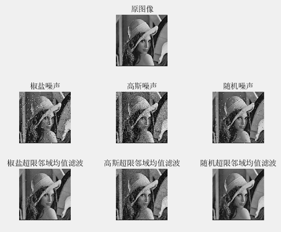

### 3. 中值滤波

中值滤波是一种非线性滤波，它使用的是窗口中的中值来替换窗口中心的像素灰度值。在 matlab 中，可以使用 `medfilt2()` 函数实现中值滤波：

```matlab
function lab3_3(filename)
    src = imread(filename);
	% generate noise ......
    % median filter
    p_dst = medfilt2(p_src); % 椒盐噪声
    g_dst = medfilt2(g_src); % 高斯噪声
    r_dst = medfilt2(r_src); % 随机噪声
end
```

运行程序的结果如下：

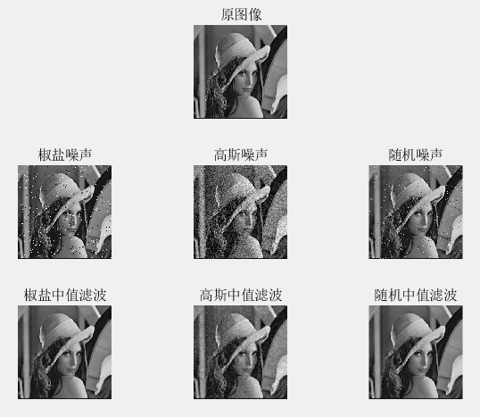

### 4. 超限中值滤波器

超限中值滤波器就是当某个像素的灰度值超过窗口中像素灰度值排序中间的那个值，且达到一定水平时，则判断该点为噪声，用灰度值排序中间的那个值来代替；否则还是保持原来的灰度值。

则超限领域平均法的实现如下：对于非图像边缘的每个像素值，获取其领域内的中值 `median_value`，然后判断该像素值与 `median_value` 之间的插值是否大于阈值 `threshold`，如果大于则认为该像素点为噪声，用中值将其替换。

```matlab
function lab3_4(filename, threshold)
    src = imread(filename);
    % generate noise ......
    % threshold median filter
    p_dst = filter(p_src, threshold); % 椒盐噪声
    g_dst = filter(g_src, threshold); % 高斯噪声
    r_dst = filter(r_src, threshold); % 随机噪声
end

% threshold median filter
function [out] = filter(in, threshold)
    out = in;
    [row, col, ~] = size(in);
    for i = 2 : (row - 1)
        for j = 2 : (col - 1)
            temp = in(i - 1: i + 1, j - 1 : j + 1);
            median_value = median(temp(:));
            if (abs(double(in(i, j)) - double(median_value)) > threshold)
                out(i, j) = median_value;
            end
        end
    end
end
```

运行指令 `lab3_4("lena.bmp", 25)` 的结果如下 (选定的阈值为 $25$)：

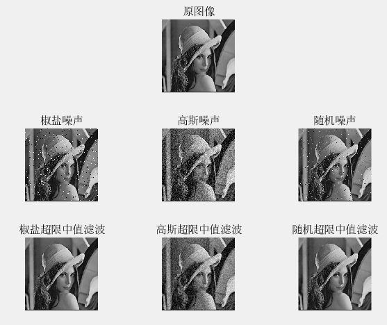

### 5. 比较四种处理方法

四种滤波器的处理效果：

1. 均值滤波器
   均值滤波器的处理效果对于轻微的噪声非常好，但对于强烈的噪声效果不太好。此外，均值滤波器可能会模糊图像的边缘和细节。
2. 超限邻域平均法
   超限邻域平均法可以更好地保留图像的边缘和细节，但在处理强烈噪声时，仍然可能会出现效果不好的情况。
3. 中值滤波器
   中值滤波器对于椒盐噪声和随机噪声的去除效果较好，但对于更复杂的噪声类型，如高斯噪声，可能会出现效果不佳的情况。
4. 超限中值滤波器
   超限中值滤波器可以更好地处理复杂的噪声类型，如高斯噪声，同时保留边缘和细节。

在处理椒盐噪声时，中值滤波器和超限中值滤波器效果较好，可以有效去除噪声并保留图像的边缘和细节；均值滤波器和超限邻域平均法由于它们的线性处理方式，可能会模糊图像的边缘和细节，因此对于椒盐噪声的处理效果较差。
在处理高斯噪声时，超限中值滤波器效果最好，可以准确地去除噪声并保留图像的边缘和细节；中值滤波器和均值滤波器的效果相对较差，可能会对图像进行轻微模糊处理；超限邻域平均法效果不稳定，可能会出现一些失真和伪影。
在处理随机噪声时，中值滤波器和超限中值滤波器效果最好，可以有效去除噪声并保留图像的边缘和细节；均值滤波器和超限邻域平均法的效果相对较差，可能会对图像进行轻微模糊处理。

### 6. 边缘检测

边缘检测需要用到下面这几种常见算子：

- Roberts 算子
- Sobel 算子
- Prewitt 算子
- Laplacian 算子
- Canny 算子

在 matlab 中可以使用边缘检测函数 `edge()` 来实现，对于拉普拉斯算子可以使用 `imfilter()` 并传入相应的模板算子即可实现：

```matlab
function lab3_6(filename)
    src = imread(filename);
    
    % edge detection
    roberts = edge(src, 'Roberts'); % Roberts 算子
    sobel = edge(src, 'Sobel'); % Sobel 算子
    prewitt = edge(src, 'Prewitt'); % Prewitt 算子
    laplace1 = imfilter(src, [0 1 0; 1 -4 1; 0 1 0]); % Laplacian 算子
    laplace2 = imfilter(src, [-1 -1 -1; -1 8 -1; -1 -1 -1]); % Laplacian 算子
    canny = edge(src, 'Canny'); % Canny 算子
end
```

运行程序的结果如下：

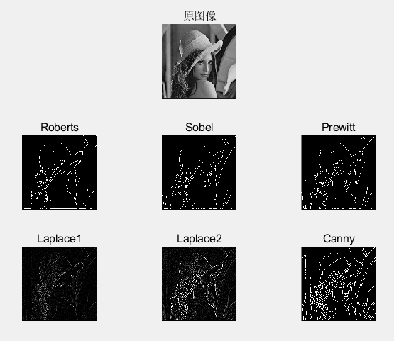

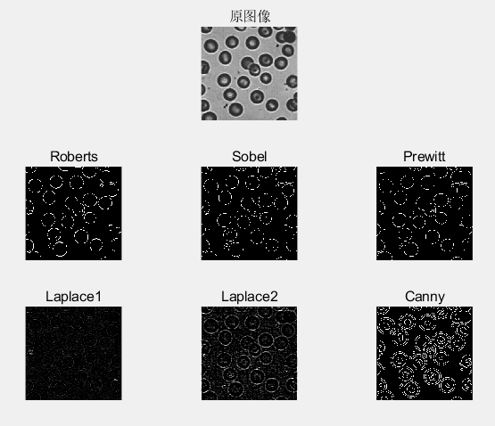

## 实验四. 图像变换及频域滤波增强

### 1. Fourier 幅度变换

对图像进行二维 Fourier 变换，可以使用 `fft2()` 函数得到其频谱，将低频移动到中心可以使用 `fftshift()` 函数实现。由于高低频幅度相差很大，为了减少幅度差距，可以对幅度做缩放，则使用 $\log(|F(u,v)|+1)$ 的方式进行缩放：

```matlab
function lab4_1(filename1, filename2)
    src1 = imread(filename1);
    src2 = imread(filename2);
    
    f1 = fft2(src1); %傅里叶变换
    f2 = fft2(src2); %傅里叶变换
    
    f_shift1 = fftshift(f1); % 移动低频
    f_shift2 = fftshift(f2); % 移动低频
    
    f_scale1 = log(abs(f_shift1 + 1)); %取幅度并进行缩放
    f_scale2 = log(abs(f_shift2 + 1)); %取幅度并进行缩放
end
```

程序的运行结果如下：

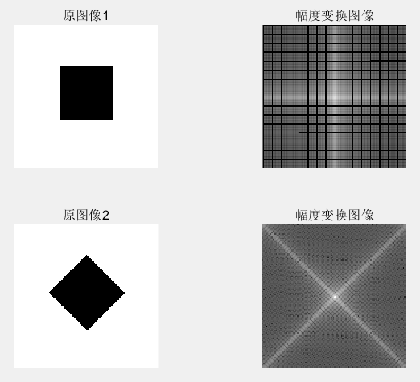

### 2. Fourier 幅度反变换

对 Fourier 系数的幅度进行 Fourier 反变换，首先通过 `abs()` 函数得到幅度值，然后通过 `ifft2()` 函数对其做二维 Fourier 反变换：

```matlab
function lab4_2(filename1, filename2)
    src1 = imread(filename1);
    src2 = imread(filename2);
    
    f1 = fft2(src1); %傅里叶变换
    f2 = fft2(src2); %傅里叶变换
    
    i_f1 = uint8(ifft2(abs(f1))); % 取幅度并进行逆变换
    i_f2 = uint8(ifft2(abs(f2))); % 取幅度并进行逆变换
end
```

程序的运行结果如下：

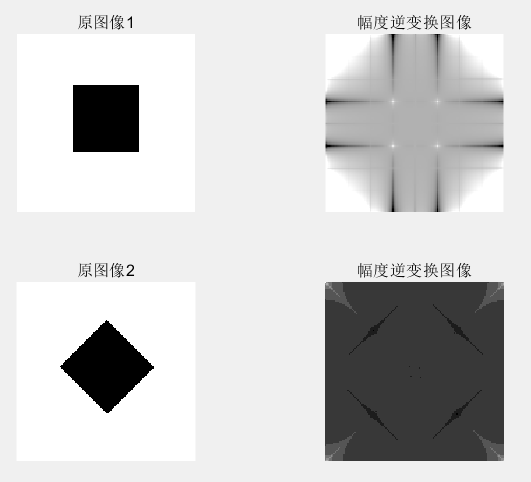

### 3. Fourier 相位反变换

对 Fourier 系数的相位进行 Fourier 反变换，首先通过 `angle()` 函数获取 Fourier 变换后的相位，同时对相位进行增强 $10000$ 倍，则有：

```matlab
function lab4_3(filename1, filename2)
    src1 = imread(filename1);
    src2 = imread(filename2);
    
    f1 = fft2(src1); %傅里叶变换
    f2 = fft2(src2); %傅里叶变换
    
    theta1 = angle(f1); % 取相位
    theta2 = angle(f2); % 取相位
    
    i_f1 = uint8(abs(ifft2(10000 * exp(1i * theta1)))); % 进行逆变换
    i_f2 = uint8(abs(ifft2(10000 * exp(1i * theta2)))); % 进行逆变换
end
```

程序的运行结果如下：

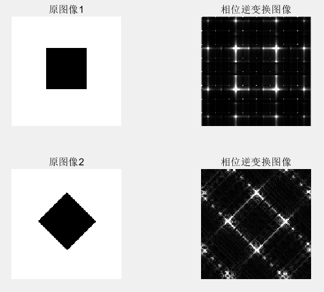

对图像幅频特性和相频特性进行说明：

对于图像的幅频特性，也就是图像的亮度变化情况，人眼对其的敏感度较低。对于图像的相位特性，也就是图像的轮廓和边缘信息，人眼对其的敏感度比较高。

从上面图像的结果可以看出，幅度逆变换的结果展示了图像的亮度分布，是图像的亮度信息，而相位逆变换的结果则体现了图像的轮廓和边缘信息，是图像的相位信息。因此，从图像逆变换的结果中可以看出，幅度逆变换能够展示出图像的亮度分布，但是很难确定图像的具体物体内容；而相位逆变换则能够更加准确地体现图像的轮廓和边缘信息，能够让人眼更敏感地识别出图像中的物体和形状。

### 4. Fourier 共轭反变换

对 Fourier 变换后的图像通过 `conj()` 函数进行共轭操作，然后再对共轭的结果进行 `ifft2()` 反变换：

```matlab
function lab4_4(filename1, filename2)
    src1 = imread(filename1);
    src2 = imread(filename2);
    
    f1 = fft2(src1); %傅里叶变换
    f2 = fft2(src2); %傅里叶变换
    
    co_f1 = conj(f1); % 取共轭
    co_f2 = conj(f2);  % 取共轭
    
    i_f1 = ifft2(co_f1); % 进行逆变换
    i_f2 = ifft2(co_f2); % 进行逆变换
end
```

运行程序的结果如下：

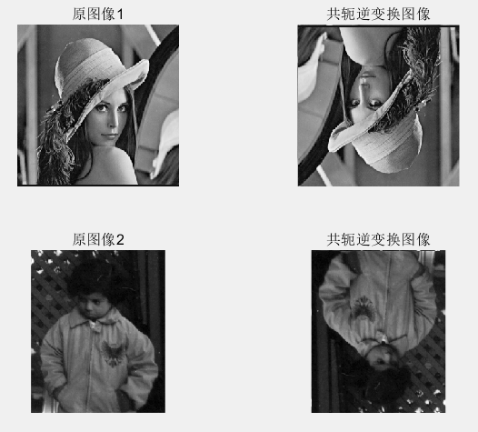

将图像的 Fourier 变换置为其共轭后进行反变换，相当于对原始图像进行共轭对称操作。在二维图像中，共轭对称操作相当于先进行水平镜像再进行垂直镜像，因此得到的逆变换图像是原始图像的对角镜像，与原始图像相比在水平和垂直方向上都进行了翻转。

### 5. 低通滤波器

低通滤波器可以让低频分量顺利通过而有效地阻止高频分量，即可滤除频域中高频部分的噪声。低通滤波表示为：

$$
G(u,v)=F(u,v)H(u,v)
$$

其中 $F(u,v)$ 为含有噪声原图像的 Fourier 变换，$H(u,v)$ 为低通滤波器的传递函数，$G(u,v)$ 为经低通滤波器后输出图像的 Fourier 逆变换。

理想低通滤波器的传递函数为：

$$
H(u,v)=\left\{\begin{matrix}1;D(u,v)\leq D_0\\ 0;D(u,v)>D_0\end{matrix}\right.
$$

其中 $D_0$ 为截止频率，$D(u,v)$ 为点 $(u,v)$ 到原点的距离。实现时，首先获取原图像的 Fourier 变换图像，并且将其低频移动到中心。然后在移动到中心之后，重构 $(u,v)$ 点坐标，并且通过 `hypot()` 函数计算点 $(u,v)$ 到原点的距离，然后计算出传递函数 $h(u,v)$，并且将图像经过低通滤波器进行处理得到结果，再将结果经过平移和逆变换得到平滑图像：


```matlab
function output = ILPF(input, threshold)
    [r, c, ~] = size(input);
    shift_f = fftshift(fft2(input)); %傅里叶变换并移动低频
    [u, v] = meshgrid(- c / 2 : c / 2 - 1, - r / 2 : r / 2 - 1); % 频率坐标
    dist = hypot(u, v); % 与原点的距离
    h = (dist <= threshold); % 传递函数 h
    g = shift_f.* h; % 滤波后的图像
    output = abs(ifft2(ifftshift(g))); % 傅里叶逆变换
end
```

巴特沃斯低通滤波器的传递函数为：

$$
H(u,v)=\frac{1}{1+\left[D(u,v)/D_{0}\right]^{2n}}
$$

实现时同理，只需要修改传递函数的定义即可：

```matlab
function output = BLPF(input, threshold, n)
    [r, c, ~] = size(input);
    shift_f = fftshift(fft2(input)); %傅里叶变换并移动低频
    [u, v] = meshgrid(- c / 2 : c / 2 - 1, - r / 2 : r / 2 - 1); % 频率坐标
    dist = hypot(u, v); % 与原点的距离
    h = 1./ (1 + ((dist./ threshold).^ (2 * n))); % 传递函数 h
    g = shift_f.* h; % 滤波后的图像
    output = abs(ifft2(ifftshift(g))); % 傅里叶逆变换
end
```

高斯低通滤波器的传递函数为：

$$
H(u,v)=e^{-\left[{D(u,v)}/{D_0}\right]^n}
$$

实现时同理，只需要修改传递函数的定义即可：

```matlab
function output = ELPF(input, threshold, n)
    [r, c, ~] = size(input);
    shift_f = fftshift(fft2(input)); %傅里叶变换并移动低频
    [u, v] = meshgrid(- c / 2 : c / 2 - 1, - r / 2 : r / 2 - 1); % 频率坐标
    dist = hypot(u, v); % 与原点的距离
    h = exp(- (dist./ threshold).^ n); % 传递函数 h
    g = shift_f.* h; % 滤波后的图像
    output = abs(ifft2(ifftshift(g))); % 傅里叶逆变换
end
```

运行程序 `lab4_5("pout.bmp", "girl.bmp", 15, 2)` 的结果如下 (阈值为 $15$，$n$ 为 $2$)：

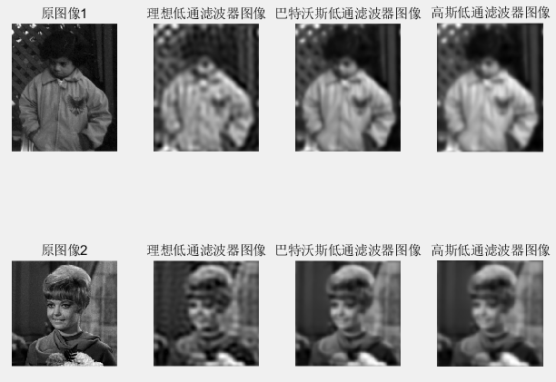

运行程序 `lab4_5("pout.bmp", "girl.bmp", 35, 2)` 的结果如下 (阈值为 $35$，$n$ 为 $2$)：

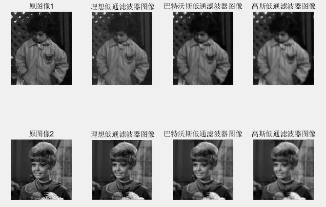

运行程序 `lab4_5("pout.bmp", "girl.bmp", 75, 2)` 的结果如下 (阈值为 $75$，$n$ 为 $2$)：

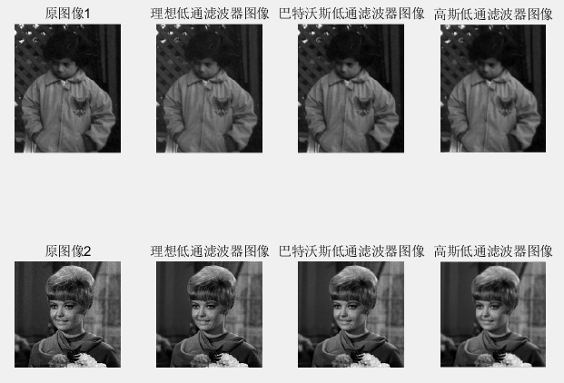

从上图可以看出，随着截止频率的降低，图像的高频部分被有效地滤除，同时图像的细节和轮廓信息也被部分损失。特别地，当截止频率较低时，理想低通滤波器会出现振铃效应，即在截止频率附近出现明显的振荡现象，导致图像出现振铃效应。而巴特沃斯低通滤波器和高斯低通滤波器具有平滑过渡的特点，因此不存在振铃效应。

同时由于高斯低通滤波器的传递函数是一个二维高斯函数，其衰减速度比理想低通滤波器和巴特沃斯低通滤波器更快，因此在滤波过程中会更加强烈地抑制高频部分，所以高斯低通滤波器的模糊程度也比较明显。

### 6. 低通滤波器去噪声

使用 $3\%$ 的椒盐噪声，高斯噪声和随机噪声的处理结果如下 (阈值为 $35$，$n$ 为 $2$)：

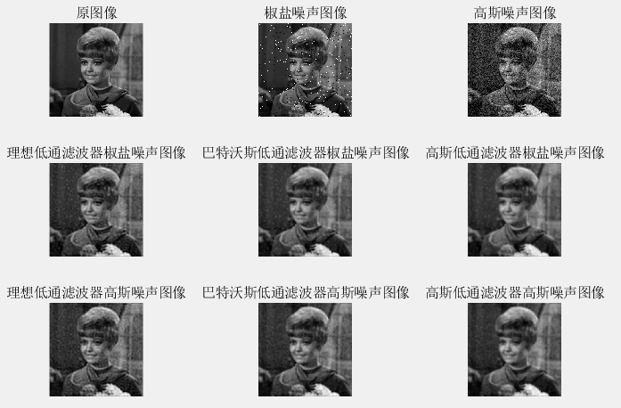

理想低通滤波器去噪的结果比较差，噪声还是有所体现，同时也存在一定的振铃现象。高斯低通滤波器去噪的结果相对平滑，但细节部分不够清晰，图像整体存在一定程度的模糊。巴特沃斯低通滤波器去噪的效果介于理想低通滤波器和高斯低通滤波器之间，细节较为清晰。总之，只考虑去噪效果而言，高斯低通滤波器的去噪效果最好。

### 7. 高通滤波器

高通滤波器与低通滤波器的作用相反，它可以让高频分量顺利通过，而使低频分量收到削弱。

理想高通滤波器的传递函数为：

$$
H(u,v)=\left\{\begin{matrix}0;D(u,v)\leq D_0\\ 1;D(u,v)>D_0\end{matrix}\right.
$$

其实现与之前低通滤波器的实现类似：

```matlab
function output = IHPF(input, threshold)
    [r, c, ~] = size(input);
    shift_f = fftshift(fft2(input)); %傅里叶变换并移动低频
    [u, v] = meshgrid(- c / 2 : c / 2 - 1, - r / 2 : r / 2 - 1); % 频率坐标
    dist = hypot(u, v); % 与原点的距离
    h = (dist > threshold); % 传递函数 h
    g = shift_f.* h; % 滤波后的图像
    output = abs(ifft2(ifftshift(g))); % 傅里叶逆变换
end
```

巴特沃斯高通滤波器的传递函数为：

$$
H(u,v)=\frac{1}{1+\left[D_{0}/D(u,v)\right]^{2n}}
$$

实现时同理，只需要修改传递函数的定义即可：

```matlab
function output = BHPF(input, threshold, n)
    [r, c, ~] = size(input);
    shift_f = fftshift(fft2(input)); %傅里叶变换并移动低频
    [u, v] = meshgrid(- c / 2 : c / 2 - 1, - r / 2 : r / 2 - 1); % 频率坐标
    dist = hypot(u, v); % 与原点的距离
    h = 1./ (1 + ((threshold./ dist).^ (2 * n))); % 传递函数 h
    g = shift_f.* h; % 滤波后的图像
    output = abs(ifft2(ifftshift(g))); % 傅里叶逆变换
end
```

高斯低通滤波器的传递函数为：

$$
H(u,v)=e^{-\left[{D_0}/{D(u,v)}\right]^n}
$$

实现时同理，只需要修改传递函数的定义即可：

```matlab
function output = EHPF(input, threshold, n)
    [r, c, ~] = size(input);
    shift_f = fftshift(fft2(input)); %傅里叶变换并移动低频
    [u, v] = meshgrid(- c / 2 : c / 2 - 1, - r / 2 : r / 2 - 1); % 频率坐标
    dist = hypot(u, v); % 与原点的距离
    h = exp(- (threshold./ dist).^ n); % 传递函数 h
    g = shift_f.* h; % 滤波后的图像
    output = abs(ifft2(ifftshift(g))); % 傅里叶逆变换
end
```

运行程序 `lab4_7("pout.bmp", "girl.bmp", 5, 2)` 的结果如下 (阈值为 $5$，$n$ 为 $2$)：


运行程序 `lab4_7("pout.bmp", "girl.bmp", 15, 2)` 的结果如下 (阈值为 $15$，$n$ 为 $2$)：

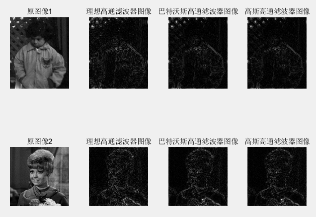

运行程序 `lab4_7("pout.bmp", "girl.bmp", 25, 2)` 的结果如下 (阈值为 $25$，$n$ 为 $2$)：

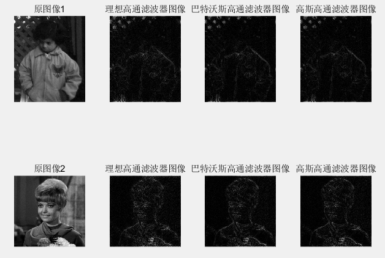

从图像效果来看，使用理想高通滤波器的处理结果最为明显，图像中的高频细节信息得到了增强。巴特沃斯高通滤波器和高斯高通滤波器的处理结果相对平滑，边缘效应也相对较小。它们的效果也不如使用理想高通滤波器明显，图像的细节信息得到的增强程度较低。虽然在这里并没有看出明显的振铃效应，但是对于理想高通滤波器而言，振铃效应是一个常见的问题。巴特沃斯高通滤波器和高斯高通滤波器相比，可以在一定程度上减轻振铃效应的出现。但是，它们也会导致一定的模糊效果，特别是对于边缘细节部分。

随着截止频率的增加，损失的信息就越多，从而使得图像的细节信息和边缘信息不断地缺失，从而导致图像模糊。在阈值达到了 $25$ 的时候，就可以看出图像的基本信息已经丢失完了。

### 8. 高频增强滤波与直方图均衡化

高频增强滤波就是对高通滤波器的传递函数进行线性增强，然后再使用新的传递函数进行高通滤波：

$$
H_e(u,v)=f_a\cdot H(u,v)+f_b
$$

那么理想高通滤波器，巴特沃斯高通滤波器和高斯高通滤波器的实现如下：

```matlab
function output = IHPF(input, threshold, fa, fb)
    [r, c, ~] = size(input);
    shift_f = fftshift(fft2(input)); %傅里叶变换并移动低频
    [u, v] = meshgrid(- c / 2 : c / 2 - 1, - r / 2 : r / 2 - 1); % 频率坐标
    dist = hypot(u, v); % 与原点的距离
    h = (dist > threshold); % 传递函数 h
    h = fa * h + fb; % 高频增强
    g = shift_f.* h; % 滤波后的图像
    output = abs(ifft2(ifftshift(g))); % 傅里叶逆变换
end

function output = BHPF(input, threshold, n, fa, fb)
    [r, c, ~] = size(input);
    shift_f = fftshift(fft2(input)); %傅里叶变换并移动低频
    [u, v] = meshgrid(- c / 2 : c / 2 - 1, - r / 2 : r / 2 - 1); % 频率坐标
    dist = hypot(u, v); % 与原点的距离
    h = 1./ (1 + ((threshold./ dist).^ (2 * n))); % 传递函数 h
    h = fa * h + fb; % 高频增强
    g = shift_f.* h; % 滤波后的图像
    output = abs(ifft2(ifftshift(g))); % 傅里叶逆变换
end

function output = EHPF(input, threshold, n, fa, fb)
    [r, c, ~] = size(input);
    shift_f = fftshift(fft2(input)); %傅里叶变换并移动低频
    [u, v] = meshgrid(- c / 2 : c / 2 - 1, - r / 2 : r / 2 - 1); % 频率坐标
    dist = hypot(u, v); % 与原点的距离
    h = exp(- (threshold./ dist).^ n); % 传递函数 h
    h = fa * h + fb; % 高频增强
    g = shift_f.* h; % 滤波后的图像
    output = abs(ifft2(ifftshift(g))); % 傅里叶逆变换
end
```

而先后进行高频增强滤波和直方图均衡化的操作如下：

```matlab
function lab4_8(filename, threshold, n, fa, fb)
    src = imread(filename);

    % show
    subplot(2, 4, 1); imshow(src, []); title('原图像'); 
    subplot(2, 4, 2); imshow(histeq(uint8(IHPF(src, threshold, fa, fb))), []); title('理想高通滤波器-直方图均衡化图像'); 
    subplot(2, 4, 3); imshow(histeq(uint8(BHPF(src, threshold, n, fa, fb))), []); title('巴特沃斯高通滤波器-直方图均衡化图像');
    subplot(2, 4, 4); imshow(histeq(uint8(EHPF(src, threshold, n, fa, fb))), []); title('高斯高通滤波器-直方图均衡化图像');
    
    subplot(2, 4, 5); imshow(src, []); title('原图像'); 
    subplot(2, 4, 6); imshow(IHPF(histeq(src), threshold, fa, fb), []); title('直方图均衡化-理想高通滤波器图像'); 
    subplot(2, 4, 7); imshow(BHPF(histeq(src), threshold, n, fa, fb), []); title('直方图均衡化-巴特沃斯高通滤波器图像');
    subplot(2, 4, 8); imshow(EHPF(histeq(src), threshold, n, fa, fb), []); title('直方图均衡化-高斯高通滤波器图像');
end
```

则运行程序的结果如下 (阈值为 $15$，$n$ 为 $2$，$f_a$ 为 $2$，$f_b$ 为 $1$)：

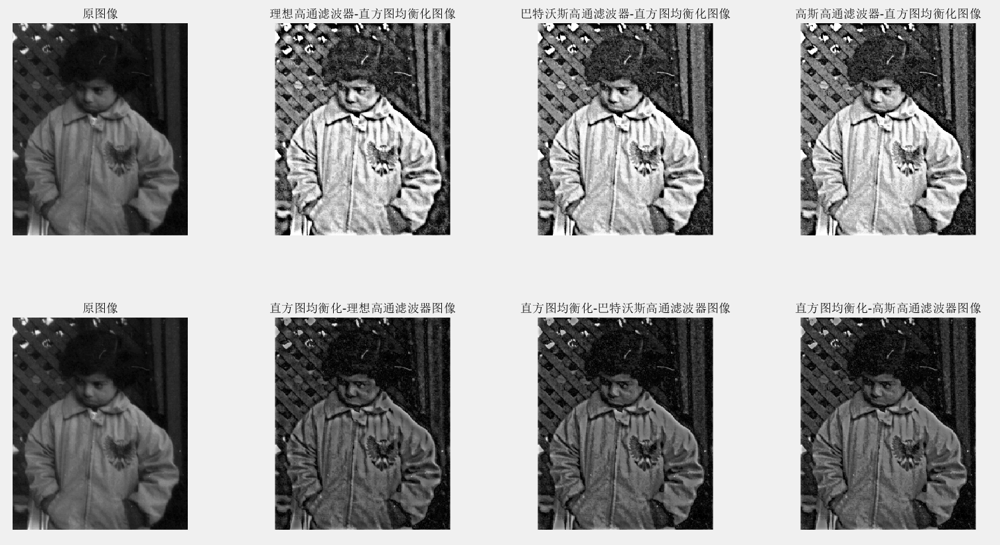

我们对图像首先进行高频增强滤波，然后进行直方图均衡化的操作进行比较：从图像效果来看，经过高频增强滤波后，图像中的细节信息得到了增强，但是图像整体的亮度并没有发生明显的改变。经过直方图均衡化后，图像的对比度得到了增强，图像的亮度分布更加均匀。因此，在这种处理顺序下，图像中的细节信息得到了增强，同时图像的亮度分布也得到了改善。

我们对图像首先进行直方图均衡化，然后进行高频增强滤波的操作进行比较：从图像效果来看，经过直方图均衡化后，图像的亮度分布得到了改善，但是图像中的细节信息并没有得到很好的增强。经过高频增强滤波后，图像中的细节信息得到了增强，但是图像的亮度分布又变得不均匀了。因此，在这种处理顺序下，虽然图像的亮度分布得到了改善，但是由于先进行直方图均衡化弱化了图像的细节信息，导致图像中的细节信息并没有得到很好的增强。

综上所述，不同的处理顺序对结果图像的影响是不同的。如果先进行高频增强滤波，再进行直方图均衡化，可以增强图像中的细节信息，同时改善图像的亮度分布。如果先进行直方图均衡化，再进行高频增强滤波，虽然图像的亮度分布得到了改善，但是图像中的细节信息并没有得到很好的增强。

## 实验五. 图像恢复与图像分割

### 1. 逆滤波与维纳滤波

逆滤波的恢复模型可以表示成如下形式：

$$
\hat{F}(u,v)=\frac{G(u,v)}{H(u,v)}+\frac{N(u,v)}{H(u,v)}
$$

其中 $G(u,v)$ 为退化的模型，而 $N(u,v)$ 表示噪声。

而维纳滤波的恢复模型的形式如下：
$$
\hat{F}(u, v)\mathrm{=}\Bigg[\frac{H^{*}(u,v)}{\left|H(u,v)\right|^{2}+\gamma\big[p_{n}(u,v)/p_{f}(u,v)\big]}\Bigg]G(u,v) \\
$$
其中 $p_f(u,v)$ 和 $p_n(u,v)$ 分别是 $f(x,y)$ 和 $n(x,y)$ 的功率谱。当没有噪声的时候，即 $p_n(u,v)=0$ 的时候，则维纳滤波与逆滤波相同。

首先我们获取图像的退化模型—— 对图像设置运动位移 $30$ 个像素、运动方向 $45$ 度，产生运动模糊图像，即退化模型。然后根据该退化模型对图像进行滤波操作进行恢复。首先使用 `fspecial` 函数用于生成一个特定类型的卷积核，其中参数 `motion` 表示生成一个运动模糊卷积核，`conv`  表示进行卷积运算，`circular` 表示在卷积时对图像进行循环填充，以保证卷积结果与原图像大小相同：

```matlab
src = imread(filename);
blurred_kernel = fspecial('motion', 30, 45); % 模糊核
motion_blurred = imfilter(im2double(src), blurred_kernel, 'conv', 'circular'); % 运动模糊图像
```

产生运动模糊图像之后，对其进行高斯噪声处理，其中采用的是均值为 $0$ 方差为 $0.00001$ 的高斯噪声：

```matlab
guass_blurred = imnoise(motion_blurred, 'gaussian', 0, 0.00001);
```

然后对其进行逆滤波操作和维纳滤波。使用函数 `deconvwmr()` 实现逆滤波和维纳滤波。`deconvwnr()` 函数用于对输入的图像进行逆滤波或维纳滤波。其中，第一个参数是输入的图像，第二个参数是用于卷积的卷积核，第三个参数是维纳滤波中的噪声方差。如果省略第三个参数，则默认进行逆滤波。

```matlab
% 逆滤波
motion_inverse = deconvwnr(motion_blurred, blurred_kernel);
gauss_inverse = deconvwnr(guass_blurred, blurred_kernel);
% 维纳滤波
motion_wiener = deconvwnr(motion_blurred, blurred_kernel); % 没有噪声
gauss_wiener = deconvwnr(guass_blurred, blurred_kernel, 0, 0.00001);
```

在这段代码中，`motion_inverse` 和 `gauss_inverse` 分别表示运动模糊图像和高斯模糊图像的逆滤波结果，没有使用维纳滤波；`motion_wiener` 和 `gauss_wiener` 分别表示运动模糊图像和高斯模糊图像的维纳滤波结果，使用了维纳滤波。

程序运行的结果如下：

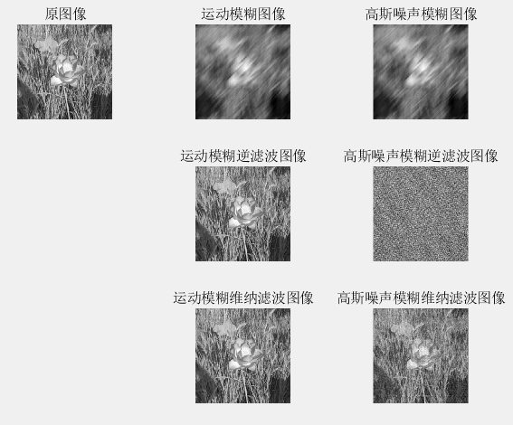

在只添加了运动模糊处理的情况下，此时逆滤波和维纳滤波的处理效果基本相同，都可以很好地恢复出原图像。在添加了运动模糊和高斯噪声处理的情况下，此时逆滤波的处理结果很差，而维纳滤波可以较好地恢复出原图像。这是因为逆滤波容易放大噪声和高频噪声，导致图像质量降低。而维纳滤波相对于逆滤波来说，可以通过噪声方差的设置来平衡去噪和保留图像细节之间的关系，更好地处理图像中的噪声和细节，从而恢复出更清晰的图像。

### 2. 大津法分割图像

大津法 (OTSU) 是基于最大类间方差的自适应阈值选取法，其算法步骤如下：

1. 统计灰度级中每个像素在整幅图像中的个数。
2. 计算每个像素在整幅图像的概率分布。
3. 对灰度级进行遍历搜索，计算当前灰度值下前景背景类间概率。
4. 通过目标函数计算出类内与类间方差下对应的阈值。

matlab 工具箱提供的 `graythresh()` 函数求取阈值采用的正是大津法。因此使用 `graythresh()` 获取大津法计算得到的阈值，然后使用 `imbinarize()` 函数进行二值化分割，使用大津法计算得到的阈值作为 `imbinarize()` 的分割阈值，该函数将输入图像中小于阈值的像素值设为 0，大于等于阈值的像素值设为 1，从而得到二值化图像。

```matlab
function lab5_2(filename)
    src = imread(filename);
    % 大津法获得阈值
    threshold = graythresh(src);
    % 分割图像
    output = imbinarize(src, threshold);
    % show
    subplot(1, 2, 1); imshow(src, []); title('原图像'); 
    subplot(1, 2, 2); imshow(output, []); title('分割结果'); 
end
```

运行程序的结果如下：

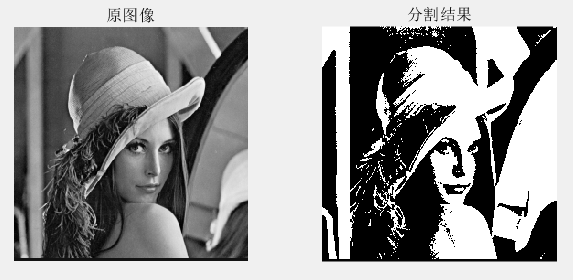

### 3. 四叉树分割合并

四叉树分割合并算法 (Quadtree Decomposition and Merging）是一种常见的图像分割算法，主要用于将一幅图像分割成多个子区域，每个子区域具有相似的颜色、纹理或亮度等特征。该算法利用四叉树的数据结构来表示图像的层次结构，并通过分割和合并的方式来实现图像分割。

四叉树是一种二叉树的变种，每个节点有四个子节点，分别表示左上、右上、左下和右下四个子区域。

图像的四叉树分割过程可以描述如下：

1. 定义初始节点为整个图像，将其加入四叉树的根节点。
2. 对当前节点进行检查，如果当前节点表示的区域已经足够均匀，则不再进行分割，否则进行分割。
3. 对当前节点进行分割，将其分成左上、右上、左下和右下四个子区域，然后将子区域加入四叉树中。
4. 重复步骤 2 和 3，直到所有节点表示的区域都足够均匀为止。

图像的四叉树合并过程可以描述如下：

1. 定义初始节点为四叉树的根节点。
2. 对当前节点进行检查，如果当前节点表示的区域是同一种颜色或具有相似的纹理特征，则将其合并成一个节点，并将其父节点标记为需要检查。
3. 重复步骤 2，直到所有节点都被检查为止。
4. 对被标记的父节点进行检查，如果其四个子节点都被合并成一个节点，则将其合并成一个节点，并将其父节点标记为需要检查。
5. 重复步骤 4，直到所有节点都被检查为止。

对于分割过程，我们使用 matlab 中的库函数 `qtdecomp()` 函数，使用 `threshold = 0.55` 来表示节点的区域，如果块中像素灰度的最大值与最小值的差大于这个阈值，则该块就会被分割。即通过 `threshold` 可以在一定程度上表示区域是否足够均匀。其中参数 $2$ 表示四叉树最小的深度。

```matlab
% 图像块的颜色范围阈值
threshold = 0.55;
% 四叉树分割
qtree = qtdecomp(src, threshold, 2);
```

然后使用四叉树分割的结果产生分块的边界：

```matlab
blocks = zeros(size(qtree));

% 区域分割，针对每个给定的块大小 dim，依次进行分割
for dim = [256 128 64 32 16 8 4 2]
    % 计算图像中包含的该大小的块的数量
    numblocks = length(find(qtree == dim));
    % 如果图像中存在该大小的块，则进行处理
    if (numblocks > 0)        
        values = repmat(uint8(1), [dim dim numblocks]);
        values(2 : dim, 2 : dim, : ) = 0;
        % 将 values 矩阵中的块插入到 blocks 矩阵中
        blocks = qtsetblk(blocks, qtree, dim, values);
    end
end
```

针对每个给定的块大小 `dim`，计算图像中包含的该大小的块的数量，即 `numblocks = length(find(qtree == dim))`。如果图像中存在该大小的块，则创建一个大小为 `dim x dim x numblocks` 的矩阵 `values`，其中除了第一个像素点（即左上角）之外，其余像素的值都设置为 0。然后调用 `qtsetblk` 函数，将 `values` 矩阵中的块插入到 `blocks` 矩阵中。`qtsetblk` 函数的输入参数包括：

- `blocks`：表示图像的分块信息，每个元素的值为该像素所在的块的编号。
- `qtree`：表示四叉树的深度和分块大小。
- `dim`：表示要插入的块的大小。
- `values`：表示要插入的块的像素值。

该代码的主要作用是将图像分成大小相等的块，以便进行后续的区域合并或其他处理。其中，块大小采用了逐步减小的方式，以获得更加细致的分割效果。值得注意的是，如果图像中不存在某个给定大小的块，则该大小的块不会被插入到 `blocks` 矩阵中，从而避免了对图像未知区域的处理。

接下来为图像的每个分块分配唯一的标记，以便后续的区域合并或其他处理

```matlab
% 为区域分割得到每个块进行标记
i = 0;
for dim = [256 128 64 32 16 8 4 2]
    [vals, r, c] = qtgetblk(src, qtree, dim);
    % 如果图像中存在该大小的块，则进行处理
    if ~isempty(vals)
        for j = 1 : length(r)
            i = i + 1;
            % 将该块内的所有像素的值设置为标记 i，以表示该像素点所在的分块
            blocks(r(j) : r(j) + dim - 1, c(j) : c(j) + dim - 1) = i;
        end
    end
end
```

1. 针对每个给定的块大小 `dim`，调用 `qtgetblk` 函数，获取图像中所有大小为 `dim x dim` 的块，以及这些块在图像中的位置。
2. 如果 `vals` 不为空，则说明图像中存在大小为 `dim x dim` 的块，即该块大小的分割是有效的。此时，代码遍历所有该大小的块，在 `blocks` 矩阵中将该块内的所有像素的值设置为一个新的标记 `i`。
3. 标记 `i` 的值在不同的块大小下是不同的，因此，由于块大小是逐步减小的，所以 `i` 的值也是不断增加的，以确保每个分块都有唯一的标记。块大小采用了逐步减小的方式，以获得更加细致的分割效果。

然后就是遍历每个分块的标记 `j`，对于每个标记，检查其与相邻分块的极差 (即像素值的最大值和最小值之差) 是否小于指定的阈值，以判断是否需要合并。

```matlab
% 将区域分割的块进行合并
for j = 1 : i
    % 生成相邻分块的边界掩码，并检查其是否与当前分块相邻
    bound = boundarymask(blocks == j, 4) & (~(blocks == j));
    % 查找边界掩码中值为 1 的像素点的行列坐标
    [r, l] = find(bound == 1);
    for k = 1 : size(r, 1)
        % 将相邻分块的像素值合并到一个数组中
        merge = src((blocks == j) | (blocks == blocks(r(k), l(k))));
        % 计算合并后数组的极差是否小于阈值
        if (range(merge( : )) < threshold * 256)
            blocks(blocks == blocks(r(k), l(k))) = j;
        end
    end
end
```

对于每个相邻的分块，使用 `boundarymask` 函数生成其边界掩码，并检查其是否与当前分块相邻。如果相邻分块的极差小于阈值，则将其与当前分块合并。具体实现方式是将两个分块的像素值合并到一个数组中，然后计算合并后数组的极差是否小于阈值。如果是，则将相邻分块的标记设置为当前分块的标记。该代码的主要作用是合并那些极差较小的分块，以减少分块的数量。其中，阈值可以控制合并的灵敏度，值越小则越容易合并，但可能会损失更多的细节信息。

最后根据合并结果得到图像分割再合并的结果：

```matlab
% 根据标记重新分割
output2 = src;
for i = 1 : 255
    for j = 1 : 255
        % 如果当前像素点处于两个不同的分块的边界上
        if (blocks(i, j) ~= blocks(i, j + 1) || blocks(i, j) ~= blocks(i + 1, j))
            output2(i, j) = 255; % 设置边界
        end
    end
end
```

1. 遍历所有分块，对于每个分块的标记，检查其与相邻分块的标记是否不同。如果不同，则说明当前像素点处于两个不同的分块的边界上。
2. 将所有处于分块边界的像素点的像素值设置为 255，以突出分块之间的边界。
3. 最终输出的图像是将所有分块之间的边界区域设置为白色的图像。

最后程序的运行结果如下：


